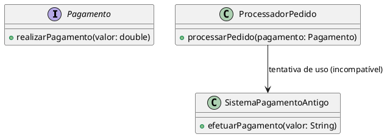
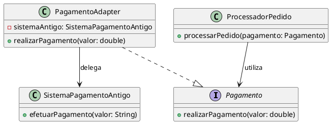

# Adapter

## Motivação

Imagine que você está desenvolvendo um sistema de e-commerce que integra diferentes métodos de pagamento. A equipe de TI decidiu migrar para uma nova interface de pagamentos modernos, mas a empresa ainda possui um sistema legado que não pode ser modificado por questões de segurança e estabilidade. O problema é o seguinte:

O sistema de e-commerce utiliza uma interface padrão para processar pagamentos (chamada Pagamento). Essa interface é esperada pelo módulo responsável pelo processamento dos pedidos. No entanto, o sistema legado de pagamentos possui uma API diferente, onde os valores devem ser enviados como String e os métodos têm nomes e comportamentos distintos.

#### Problema:

- Incompatibilidade de Interfaces: O módulo de processamento espera trabalhar com objetos que implementam a interface Pagamento (método realizarPagamento(double valor)), mas o sistema legado utiliza um método efetuarPagamento(String valor).

- Manutenção e Evolução: Não é possível modificar o sistema legado, pois ele é crítico e já está em produção. Porém, a nova interface está sendo implementada para facilitar futuras integrações.

- Uniformidade: O sistema de e-commerce precisa que todos os módulos, independentemente da implementação de pagamento, sigam a mesma interface para simplificar o código e garantir a consistência.
  



#### Como o Adapter Resolve o Problema
O padrão Adapter atua como um "conversor" entre o sistema legado e a nova interface. Ele cria uma classe (o Adapter) que implementa a interface Pagamento e, internamente, converte as chamadas para os métodos do sistema legado.



### Estrutura 


### Participantes

- Target (Pagamento): 
  - Define a interface específica que o Client espera (semelhante a Shape).
- Client (ProcessadorPagamento): 
  - Colabora com objetos que implementam a interface Target (como o DrawingEditor).
- Adaptee (SistemaPagamentoAntigo): 
  - Classe existente com uma interface incompatível (como o TextView).
- Adapter (PagamentoAdapter): 
  - Adapta a interface do Adaptee para a interface Target (como o TextShape).


### Exemplo: 

####  Interface Pagamento - Target

```java
public interface Pagamento {
    void realizarPagamento(double valor);
}
```

#### Classe SistemaPagamentoAntigo - Adaptee
```java 
public class SistemaPagamentoAntigo {
    // Método com assinatura e tipo de parâmetro diferente
    public void efetuarPagamento(String valor) {
        System.out.println("Pagamento realizado pelo sistema legado no valor de: " + valor);
    }
}
```

####  Classe PagamentoAdapter - Adapter
```java
public class PagamentoAdapter implements Pagamento {
    private SistemaPagamentoAntigo sistemaPagamentoAntigo;
    
    public PagamentoAdapter(SistemaPagamentoAntigo sistemaPagamentoAntigo) {
        this.sistemaPagamentoAntigo = sistemaPagamentoAntigo;
    }
    
    @Override
    public void realizarPagamento(double valor) {
        // Converte o valor para String e delega a chamada para o sistema legado
        String valorFormatado = String.format("%.2f", valor);
        sistemaPagamentoAntigo.efetuarPagamento(valorFormatado);
    }
}
```

#### Classe ProcessadorPagamento - Client 

```java
public class ProcessadorPagamento {
    // Método que processa o pagamento usando a interface Pagamento (Target)
    public void processarPagamento(Pagamento pagamento, double valor) {
        pagamento.realizarPagamento(valor);
    }
    
    public static void main(String[] args) {
        ProcessadorPagamento processador = new ProcessadorPagamento();
        
        // Exemplo com sistema moderno: a implementação já segue a interface Pagamento (Target)
        Pagamento pagamentoModerno = new Pagamento() {
            @Override
            public void realizarPagamento(double valor) {
                System.out.println("Pagamento realizado pelo sistema moderno no valor de: " + valor);
            }
        };
        processador.processarPagamento(pagamentoModerno, 150.00);
        
        // Sistema legado que não segue a interface desejada (Adaptee)
        SistemaPagamentoAntigo sistemaLegado = new SistemaPagamentoAntigo();
        
        // Adapter que adapta o sistema legado para a interface Pagamento (Target)
        Pagamento pagamentoLegado = new PagamentoAdapter(sistemaLegado);
        processador.processarPagamento(pagamentoLegado, 200.00);
    }
}

```